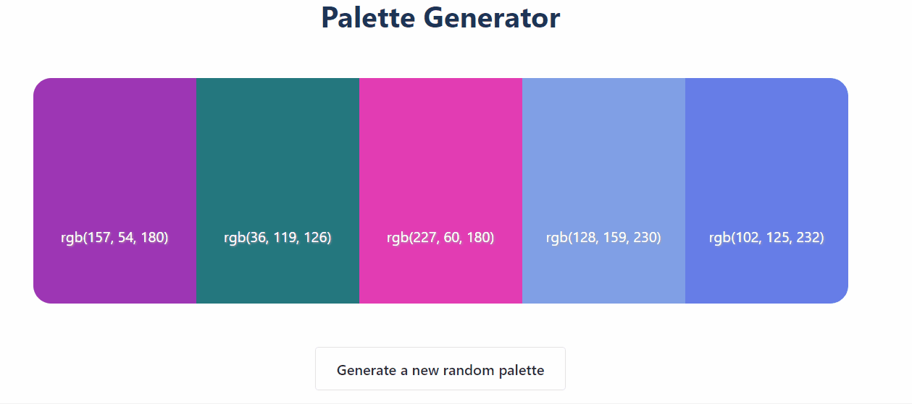

# Palette Generator

This small project derives from The Modern React Bootcamp's color exercise. Inspired by [coolors.co](coolors.co)

[Key generator by gordonbrander.](https://gist.github.com/gordonbrander/2230317)
[Button design retrived from CSS Scan.](https://getcssscan.com/css-buttons-examples)

## Functionalities
* Change individual color by clicking on it
* Copy the rgb to the clipboard by clicking on the color code
* Generate a new palette by clicking on the button 

## Preview
